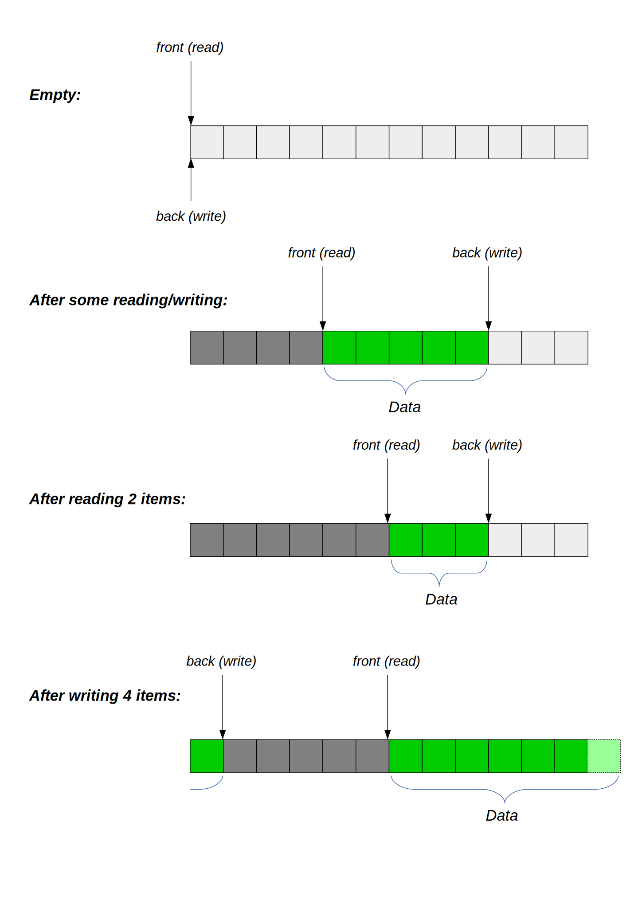
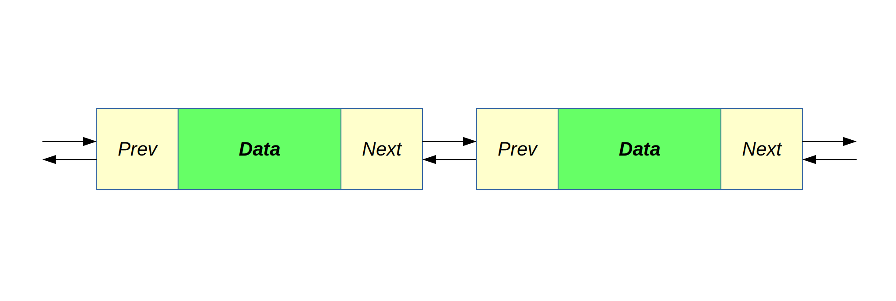
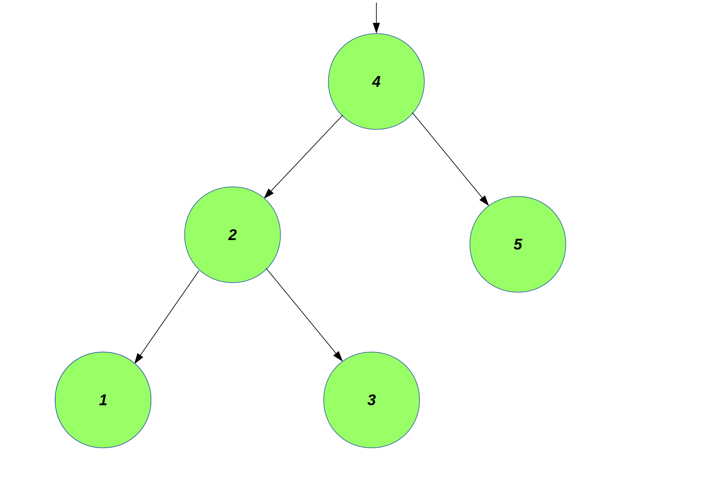
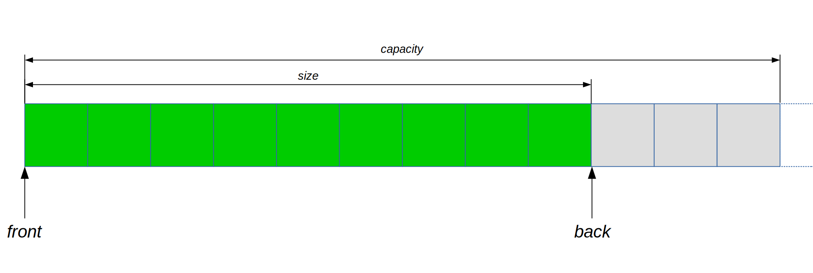

Containers
==========

The standard library module 'std.container' contains various container types, explained briefly here.

Circular Queue
--------------

A circular queue uses a fixed size array to hold a queue, in which the read and write positions advance to the end of the buffer and wrap-around when they reach the end. As an addition to the normal queue operations it is possible to access elements by index.

Supported operations:

* **create** - Create a queue of the given capacity.
* **empty** - Check if queue is empty.
* **full** - Check if queue is full.
* **size** - Get current number of elements in queue.
* **capacity** - Get total number of elements that could be stored in queue.
* **front** - Access first element (constant time).
* **back** - Access last element (constant time).
* **index** - Access an element by position (constant time).
* **push_back** - Add element to back of queue (constant time).
* **pop_front** - Remove element from front of queue (constant time).

Here's an example:

.. code-block:: c++

	auto queue = std::circular_queue<int>(3u);
	
	assert queue.empty();
	
	queue.push_back(1);
	queue.push_back(2);
	queue.push_back(3);
	
	assert queue.full();
	
	const int value1 = queue.front();
	queue.pop_front();
	const int value2 = queue.front();
	queue.pop_front();
	const int value3 = queue.front();
	queue.pop_front();
	
	assert queue.empty();
	
	// etc.

List
----

A linked list data structure.

Supported operations:

* **create** - Create empty list (constant time).
* **empty** - Check if list is empty.
* **size** - Get list size.
* **front** - Access first element (constant time).
* **back** - Access last element (constant time).
* **push_back** - Add element to back of list (constant time).
* **pop_back** - Remove element from back of list (constant time).
* **push_front** - Add element to front of list (constant time).
* **pop_front** - Remove element from front of list (constant time).

Here's an example:

.. code-block:: c++

	auto list = std::list<int>();
	
	assert list.empty();
	
	list.push_back(2);
	list.push_front(1);
	list.push_back(3);
	
	const int value3 = list.back();
	list.pop_back();
	const int value1 = list.front();
	list.pop_front();
	const int value2 = list.front();
	list.pop_front();
	
	assert list.empty();
	
	// etc.

Map
---

An associative map from unique keys (which must have an ordering) to values.

Supported operations:

* **create** - Create empty map (constant time).
* **empty** - Check if map is empty.
* **size** - Get map size.
* **clear** - Remove all elements from map.
* **index** - Access value by key (logarithmic time).
* **insert** - Insert key/value mapping; one may not already exist (logarithmic time).
* **try_insert** - Try to insert an key/value mapping; one may already exist (logarithmic time).
* **erase** - Remove existing key/value mapping.

Here's an example:

.. code-block:: c++

	auto map = std::map<int, int>();
	
	assert map.empty();
	
	map.insert(2, 20);
	map.insert(1, 10);
	map.insert(3, 30);
	
	const int value10 = map[1];
	const int value20 = map[2];
	const int value30 = map[3];
	
	map.clear();
	
	assert map.empty();
	
	// etc.

Set
---

A set of unique values (which must have an ordering).

Supported operations:

* **create** - Create empty set (constant time).
* **empty** - Check if set is empty.
* **size** - Get set size.
* **clear** - Remove all elements from set.
* **index** - Access value in set (logarithmic time).
* **insert** - Insert a value; may not already exist (logarithmic time).
* **try_insert** - Try to insert a value; may already exist (logarithmic time).
* **erase** - Remove existing value.

Here's an example:

.. code-block:: c++

	auto set = std::set<int>();
	
	assert set.empty();
	
	set.insert(2);
	set.insert(1);
	set.insert(3);
	
	const int value1 = set[1];
	const int value2 = set[2];
	const int value3 = set[3];
	
	set.clear();
	
	assert set.empty();
	
	// etc.

Varray
------

A 'varray' is a dynamically resizable array type; this is essentially the equivalent of C++'s std::vector, named to clearly identify it as an array and to not clash with a geometry 'vector'.

Supported operations:

* **create** - Create an empty array (constant time).
* **empty** - Check if array is empty.
* **size** - Get current array size.
* **resize** - Change array size.
* **capacity** - Get current array size.
* **reserve** - Allocate backing storage for at least the specified number of elements.
* **front** - Access first element (constant time).
* **back** - Access last element (constant time).
* **index** - Access an element by position (constant time).
* **push_back** - Append an item to the array (amortized constant time).
* **pop_back** - Remove last element from array (constant time).

Here's an example:

.. code-block:: c++

	auto array = std::varray<int>();
	assert array.empty();
	array.push_back(1);
	array.push_back(2);
	array.push_back(3);
	
	int total = 0;
	for (const int value: array.all()) {
		total += value;
	}
	
	// etc.

