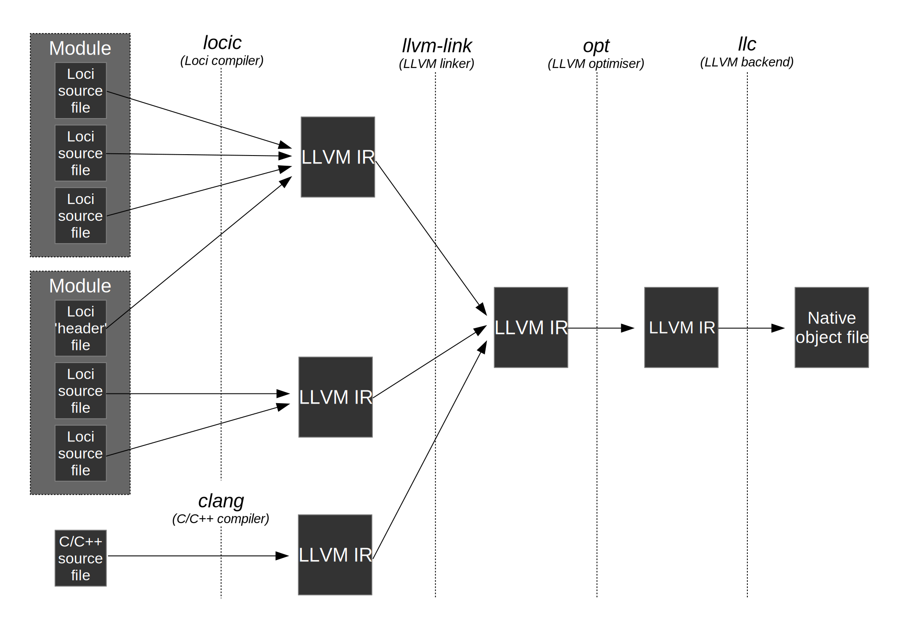

Modules
=======

Loci is intended to be an excellent language for defining and implementing system-level APIs, as well as providing extremely fast compile times; modules have been designed with these goals in mind.

All code in Loci is divided into sets of classes/functions called 'modules', which have their own sets of imported and exported functionality that are connected via well-defined stable APIs. For example, the standard library module 'std.container' depends on the heap-allocation functionality provided by 'std.memory'.

It's typical for a module to consist of multiple source files and these are **all** provided to the Loci compiler at the **same** time and it will then analyse the source files together (with :doc:`Multi-pass Compilation <MultiPassCompilation>`). This means that the need for function/class declarations is reduced to those cases where functions or classes are part of a module API. Here's a diagram showing the compilation model of Loci:

Here's a series of commands that might correspond with the steps in the diagram:

.. code-block:: bash

	pushd ModuleA
	locic -o ModuleA.bc SourceFile1.loci SourceFile2.loci
	popd
	pushd ModuleB
	locic -o ModuleB.bc SourceFile1.loci SourceFile2.loci SourceFile3.loci ../ModuleA/HeaderFile.loci
	popd
	pushd Cpp
	clang++ -emit-llvm -o Cpp.bc SourceFile.cpp
	popd
	llvm-link -o CombinedModule.bc ModuleA/ModuleA.bc ModuleB/ModuleB.bc Cpp/Cpp.bc
	opt -o OptimisedModule.bc CombinedModule.bc
	llc -o AssemblyFile OptimisedModule.bc

This diagram shows how Loci source files are grouped into modules, built by the compiler and then potentially linked with other C or C++ source code (the diagram shows the LLVM/Clang toolchain but theoretically a Loci compiler could use any toolchain). Each module might correspond to a static library or a shared library, though it's possible to combine multiple modules, with one module providing the exported symbols of the library.

To facilitate modules, the language supports *importing* and *exporting* symbols and constructs from a module. Any symbols or constructs not marked for import and export are considered to be internal, and therefore unavailable for linking.

A 'header' file is shown in the diagram, which is in fact just a Loci source file that contains the matching *import* statements for the module's exported symbols/constructs. So, for example, the creator of a module might provide one or more 'header' files with their module's binary that describe the module's API.

Imports
-------

Here's an example of an imported function:

.. code-block:: c++

	import double sqrt(double value) noexcept;

This code imports an external function named 'sqrt', presumably referring to the C standard library function. This *import* statement is 'unnamed', meaning that no module name is provided and therefore no symbol name mangling occurs (assuming the function is in the global namespace).

Here's another example using a named *import* statement:

.. code-block:: c++

	import custom.module 1.0.0 {
		class CustomClass {
			static CustomClass Create();
			
			void doSomething();
		}
	}

In this case the class 'CustomClass' is being imported from another module with name 'custom.module' and API version '1.0.0'. Note that the API version must exactly match that used by the corresponding module's export statement.

Exports
-------

This is extremely similar to the *import* statements. Here are examples matching the above:

.. code-block:: c++

	export double sqrt(double value) noexcept {
		return internalSqrtFunction(value);
	}

.. code-block:: c++

	export custom.module 1.0.0 {
		class CustomClass(int member0, int member1) {
			static Create() {
				return @(1, 2);
			}
			
			void doSomething() {
				printf(C"CustomClass(%d, %d)\n", @member0, @member1);
			}
		}
	}

API Versions
------------

API versions are an extremely useful feature that ensures developers can retain module compatibility while continuing to enhance their APIs. In the example above 'custom.module' is exporting 'CustomClass' with API version 1.0.0.

It may turn out that the module developer decides to add a new class, change a method name, perhaps even modify documented behaviour etc. Any of these changes should be provided by a new API version; **DO NOT MODIFY AN EXISTING API!** Here's an example:

.. code-block:: c++

	// api/v1_0_0/CustomClass.loci
	import custom.module 1.0.0 {
		class CustomClass {
			static CustomClass Create();
			
			void doSomething();
		}
	}

.. code-block:: c++

	// api/v1_1_0/CustomClass.loci
	import custom.module 1.1.0 {
		class CustomClass {
			static CustomClass Create();
			
			// New method!
			int getFirstValue() const;
			
			// Renamed from 'doSomething'.
			void printValues() const;
		}
	}

This is a Loci 'header' that a module developer might provide to clients (tools will soon be available to automate most of this process). A few changes have been made to the module in the new API version, however the old API version is also provided. This means that existing clients can continue to use the old API version without any issues, while new clients can use the new API version; existing clients can of course upgrade in due course.

It's important to note that the version here is *not* the release version; you could release multiple versions of software that implement the same set of APIs. The version here therefore refers to the API and so would usually be incremented according to changes in the API.

Here's how a client might use this API:

.. code-block:: c++

	void function() {
		auto object = CustomClass();
		object.doSomething();
	}

.. code-block:: bash

	locic -o FunctionModule.bc Function.loci ../UpstreamModule/api/v1_0_0/CustomClass.loci

Note that the user passes the 'header' file along with their own module source file to the compiler (rather than searching through paths on the build machine). This enables a useful deployment strategy in which an upstream project finalises an API and releases it to downstream projects, who **copy** the header files for the particular upstream API version into their own projects; this removes any need to find files on the build machine when building the downstream project.

Here's another iteration of the API:

.. code-block:: c++

	// api/v1_0_0/CustomClass.loci
	import custom.module 1.0.0 {
		class CustomClass {
			static CustomClass Create();
			
			void doSomething();
		}
	}

.. code-block:: c++

	// api/v1_1_0/CustomClass.loci
	import custom.module 1.1.0 {
		class CustomClass {
			static CustomClass Create();
			
			int getFirstValue() const;
			
			// Renamed from 'doSomething'.
			void printValues() const;
		}
	}

.. code-block:: c++

	// api/v1_2_0/CustomClass.loci
	import custom.module 1.2.0 {
		class CustomClass {
			static CustomClass Create();
			
			int getFirstValue() const;
			
			// New method!
			int getSecondValue() const;
			
			void printValues() const;
		}
	}

There are now 3 API versions here, and it's possible the module developer is now overloaded maintaining backwards compatibility! Hence they might decide to deprecate the oldest API:

.. code-block:: c++

	// api/v1_0_0/CustomClass.loci
	import(deprecated) custom.module 1.0.0 {
		class CustomClass {
			static CustomClass Create();
			
			void doSomething();
		}
	}

.. code-block:: c++

	// api/v1_1_0/CustomClass.loci
	import custom.module 1.1.0 {
		class CustomClass {
			static CustomClass Create();
			
			int getFirstValue() const;
			
			// Renamed from 'doSomething'.
			void printValues() const;
		}
	}

.. code-block:: c++

	// api/v1_2_0/CustomClass.loci
	import custom.module 1.2.0 {
		class CustomClass {
			static CustomClass Create();
			
			int getFirstValue() const;
			
			// New method!
			int getSecondValue() const;
			
			void printValues() const;
		}
	}

In this case, the compiler will generate warnings when clients re-build their code to encourage them to upgrade to a more recent API.

In C and C++
------------

Modules in Loci (combined with :doc:`Multi-pass Compilation <MultiPassCompilation>`) provide a clean, simple and fast alternative to C and C++ header files.

In C and C++, no source file can access the structs or functions implemented by another file unless it has its own declarations. Here's an example in C++:

.. code-block:: c++

	// Source file 'A.cxx'.
	struct SomeStruct{ int i; };
	
	SomeStruct function(){
		SomeStruct s;
		s.i = 42;
		return s;
	}

.. code-block:: c++

	// Source file 'B.cxx'.
	
	struct SomeStruct{ int i; };
	SomeStruct function();
	
	int main(){
		SomeStruct s = function();
		printf("Number is %d.\n", s.i);
		return 0;
	}

In this case, file 'B.cxx' must provide declarations for the implementations in file 'A.cxx', since the compiler compiles each source file separately and therefore without reference to other source files.

Header Files
~~~~~~~~~~~~

This is of course problematic if the structures and functions defined in one source file need to be used in many source files, particularly if there are many functions, in which case re-writing the declarations for each source file wastes development time. The solution is to use header files:

.. code-block:: c++

	// Header 'Header.hpp'.
	
	struct SomeStruct{ int i; };
	SomeStruct function();

.. code-block:: c++

	// File 'A'.
	#include "Header.hpp"
	
	SomeStruct function(){
		SomeStruct s;
		s.i = 42;
		return s;
	}

.. code-block:: c++

	// File 'B'.
	#include "Header.hpp"
	
	int main(){
		SomeStruct s = function();
		printf("Number is %d.\n", s.i);
		return 0;
	}

Header files take advantage of the preprocessor, via an \#include, to copy the text from a header file directly into a number of source files.

Header Guards
~~~~~~~~~~~~~

Headers may also need to include each other, but unfortunately this can create problems:

.. code-block:: c++

	// Header 'Header1.hpp'.
	struct SomeStruct{ int i; };

.. code-block:: c++

	// Header 'Header2.hpp'.
	#include "Header1.hpp"
	
	SomeStruct function();

.. code-block:: c++

	// File 'A'.
	#include "Header1.hpp"
	#include "Header2.hpp"
	
	SomeStruct function(){
		SomeStruct s;
		s.i = 42;
		return s;
	}

.. code-block:: c++

	// File 'B'.
	#include "Header2.hpp"
	
	int main(){
		SomeStruct s = function();
		printf("Number is %d.\n", s.i);
		return 0;
	}

This will cause an error in 'A.cxx' since the header 'Header1.hpp' is included twice, and therefore the struct definition appears twice in its code, which is not allowed in C or C++. The solution to this problem is header guards:

.. code-block:: c++

	// Header 'Header1.hpp'.
	#ifndef HEADER1_HPP
	#define HEADER1_HPP
	
	struct SomeStruct{ int i; };
	
	#endif

.. code-block:: c++

	// Header 'Header2.hpp'.
	#ifndef HEADER2_HPP
	#define HEADER2_HPP
	
	#include "Header1.hpp"
	
	SomeStruct function();
	
	#endif

.. code-block:: c++

	// File 'A'.
	#include "Header1.hpp"
	#include "Header2.hpp"
	
	SomeStruct function(){
		SomeStruct s;
		s.i = 42;
		return s;
	}

.. code-block:: c++

	// File 'B'.
	#include "Header2.hpp"
	
	int main() {
		SomeStruct s = function();
		printf("Number is %d.\n", s.i);
		return 0;
	}

The use of the preprocessor, the need for header guards, dependencies on the particular program order, the lack of any kind of versioning and the need for separate header files with declarations for essentially all functions/classes mean that it's substantially more tedious, error-prone and slow to develop libraries (and APIs) in C and C++.

Implementation
--------------

See:

* :doc:`Multi-pass Compilation <MultiPassCompilation>`
* :doc:`Name Mangling <NameMangling>`

